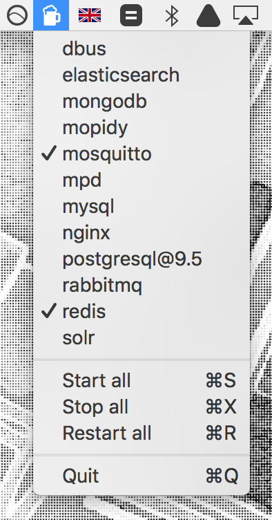

brew-services-menubar
===

> An OS X menu item for starting and stopping homebrew services.

This reads the [homebrew services](https://github.com/Homebrew/homebrew-services) command, showing you the status of your services and allowing them to be started, stopped and restarted.



## Install

### Using Homebrew Cask

```
brew install --cask brewservicesmenubar
```

### Manually

Download from the [Releases](https://github.com/andrewn/brew-services-menubar/releases) page.

### Autostart

The program doesn't have an option to autostart itself, so you may want to open _System Preferences_ -> _Users & Groups_ -> _Login Items_ and add the application to the list to have it start when you log in.

## Usage

- Start a specific service by clicking its name
- Stop a specific running service (indicated with a tick) by clicking its name
- Hold the <kbd>Option</kbd> key to allow a single service to be restarted

## Configuration

By default looks for Homebrew at `/usr/local/bin/brew` and `/opt/Homebrew/bin/brew`.
If this not correct for your setup, you can customize it using:

```sh
defaults write andrewnicolaou.BrewServicesMenubar brewExecutable /usr/local/bin/brew
```

## Contributors

- Andrew Nicolaou (https://github.com/andrewn)
- Stéphan Kochen (https://github.com/stephank)
- Stefan Sundin (https://github.com/stefansundin)

## License

Icon is [Beer by Enemen from the Noun Project](https://thenounproject.com/search/?q=beer&i=783212).
